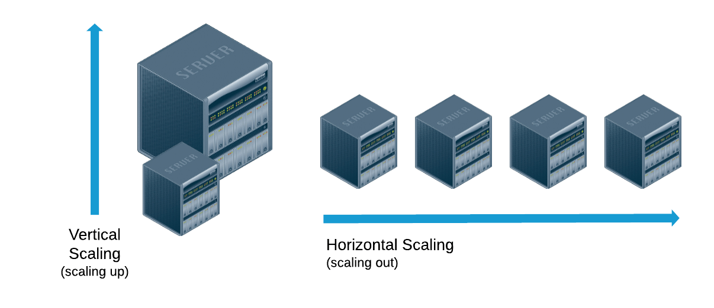

# What is EC2?
It's Elastic Compute Cloud and it's like Virtual private server (VPS) but it's on cloud and it has auto-scalling feature but with this service you are responsiable for security of server (OWASP Top 10), get up to date the opreation system, config tools and etc.

# Type
EC2 has several type for several purpose t2,t3 for general purpose c type for platform that need cpu and etc.

We have AWS calculator for determind the price of service [link](https://calculator.aws/#/addService)
Another site available for determind the price of EC2 [link]('https://instances.vantage.sh/')

# Auto Scalling 
We have two type of scalling: 
- Horizantal scalling
- vertical scalling

For auto scalling wacth this course: `Amazon Web Services: Automation and Optimization`

# BackUp
We can get snapshot of our instance in Action part and use this snapshot to run new instance with same configuration.
this snapshot is AMI (Amazon Machine Image).