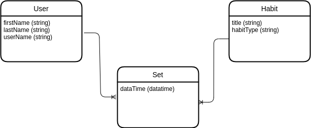
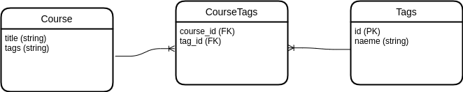

## Data Modeling
- Understand the requirements
- Build a conceptual model
- Build a logical model
- Build a physical model
  
### Understand the requirements
In the first stage we should get deep understand of platform requirement. for example read proposal or business plan or get feedback from user.

### Build a conceptual model
It's a simple version of ER and just show the entities and relations that exist between entities.
Note: We should set name of features in camlecase. 

### Build a logical model
In this step, we use a conceptual model and explain it completely with data type and clear relation between entities.

### Build a physical model
In this step finally we implement the database from the logical model.
Note: 
- In physical model we should implement table name plural.
- We should not start the name of feature with table name.
- When we have float data type we should start with low number range to prevent waste your disk storage.

We implement primery key column in each table for comunicate with other tables and this id is uniqe.

#### Relation Between Tables
When we relate two tables to each other, we have parent and child in this relation and store parent primery key in the child table. we have three types of relation:
- one to one -> we should choose parent and child.
- one to many -> one side is parent and many side is child.
- many to many -> this type of relation convert to one to many by adding another table.

#### Many To Many 
We should convert many to many to one to many by adding new table with foreign keies from those tables. in this situation we have two way for add primery key column for this table:
- use combination of table_one_foreign_key, table_two_foreign_key
    - advantage: prevent to wast your disk storage
    - disadvantage: if in the future you want to relate this table with another table you should repate this long primery key in that table  
- implement primery key column 
    - advantage: if in the future you want to relate this table to anther table you can do it without lose your storage.
    - disadvantage: you should store addition data at implement time.

#### Foreign Key
When we use foreign key we should specific on_delete and on_update features and I recommend to set on_delete to restrict and on_update to cascade

### Normalization
After we design our database we should check that we don't have redundent or duplicate data this check up is normalization and it has 7 layers but in 99 percents of application first 3 layer is enough.

#### First Layer Of Normalization
Each column should have a single value and we can't have repeated columns.

For example: 

In the above picture tags column get multi-value and we can't add another column for tags. we should do like this:

We separate tags as another table. course and tags are tables that have many to many relations. we should convert this many-to-many relation to two one-to-many relations like below : 

This third table is a link table and the primary key of this table is a combination of course_id, tag_id.

This is the first layer of normalization.

#### Second Layer Of Normalization
Every table should describe one entity, and every column in that table should describe that entity.
Describe this layer on the previous example:

In the above picture we have instructor column in course table But this column is not about course entity and we sperate this column to another table like below:

#### Third Layer Of Normalization
A column in table should not be derived from other columns.

For example see the below table:

The full_name column is dependent on first_name and last_name and we should drop this column.

### NOTE
When you want to design the database you should think about problem domain and Don't predict future problem and implement universal model.