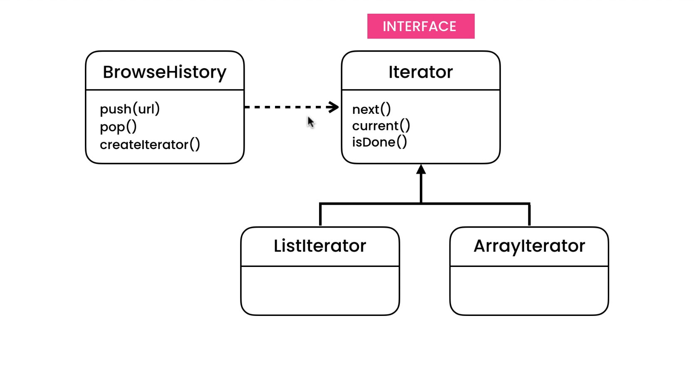

# What is Iterator pattern for?
This pattern use for iterate condition and decouple algorithms from containers.
for example you want iterate in two or more way:
- iterate list
- iterate array



# Implement Of Iterator Pattern

interface.py implement like below

```Python
import abc


class IteratorInterface(metaclass=abc.ABCMeta):
    @classmethod
    def __subclasshook__(cls, subclass):
        return (
            hasattr(subclass, 'hasnext') and
            callable(subclass.hasnext) and
            hasattr(subclass, 'current') and
            callable(subclass.current) and
            hasattr(subclass, 'next') and
            callable(subclass.next) or
            NotImplemented
        )

    @abc.abstractmethod
    def hasnext(self) -> bool:
        raise NotImplementedError

    @abc.abstractmethod
    def current(self):
        raise NotImplementedError

    @abc.abstractmethod
    def next(self):
        raise NotImplementedError

```
This is a formal approch of interface in pyhton.

browser_history.py implement like below 

```Python
from iterator_interface import IteratorInterface
from typing import List


class BrowserHistory:
    def __init__(self):
        self.urls = []

    def push(self, url: str):
        self.urls.append(url)

    def pop(self) -> str:
        return self.urls.pop()

    def createIterator(self) -> IteratorInterface:
        return self.ArrayIterator(self)

    class ArrayIterator(IteratorInterface):
        def __init__(self, history):
            self.index = 0
            self.history = history

        def hasnext(self) -> bool:
            return (self.index < len(self.history.urls))

        def current(self) -> str:
            return self.history.urls[self.index]

        def next(self):
            self.index += 1

```
In this file we implement ArrayIterator for iterat in the array if in futuer we decide to change the data structuer we can implement new class.

main.py implement like below 

```Python
from browser_history import BrowserHistory


def main():
    print('start')
    browser = BrowserHistory()
    browser.push('pornhub.com')
    browser.push('google.com')
    browser.push('yahoo.com')
    browser.push('varzesh3.com')
    print('push complete')
    iterator = browser.createIterator()
    while(iterator.hasnext()):
        print(iterator.current())
        iterator.next()


if __name__ == '__main__':
    main()

```
