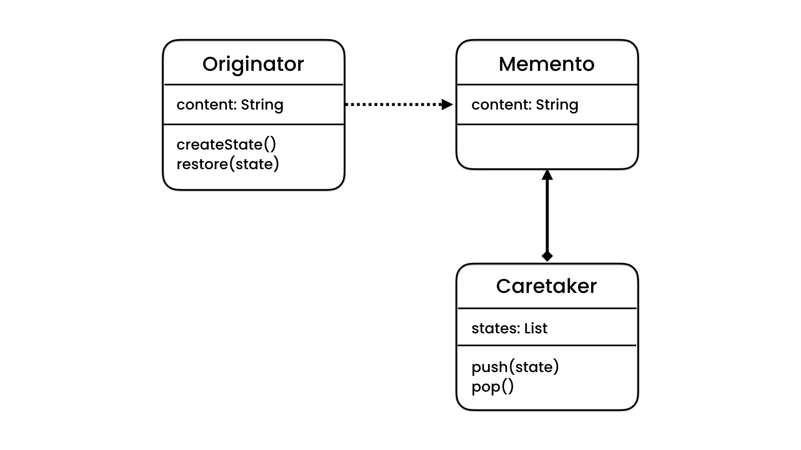

## Why Memento pattern
We want to implement undo feature with memento design pattern.

We want three classes that communication between them displayed in the below UML .


In this problem Memento class is EditorState and Originator class is Editor and CareTaker class is History.

Editor.java:

```Java

public class Editor {
    private String content;

    public EditorState createState(){
        return new EditorState(content);
    }
    public void restore(EditorState state){
        content = state.getContent();
    }
    public String getContent() {
        return content;
    }

    public void setContent(String content) {
        this.content = content;
    }
}

```
EditorState.java:

```Java
public class EditorState {
    private final String content;

    public EditorState(String content) {
        this.content = content;
    }

    public String getContent() {
        return content;
    }
}
```

History.java:

```Java
import java.util.ArrayList;
import java.util.List;

public class History {
    private List<EditorState> states = new ArrayList<>();

    public void push(EditorState state){
        states.add(state);
    }
    public EditorState pop(){
        var lastIndex = states.size()-1;
        var lastState = states.get(lastIndex);
        states.remove(lastState);
        return lastState;
    }
}
```
