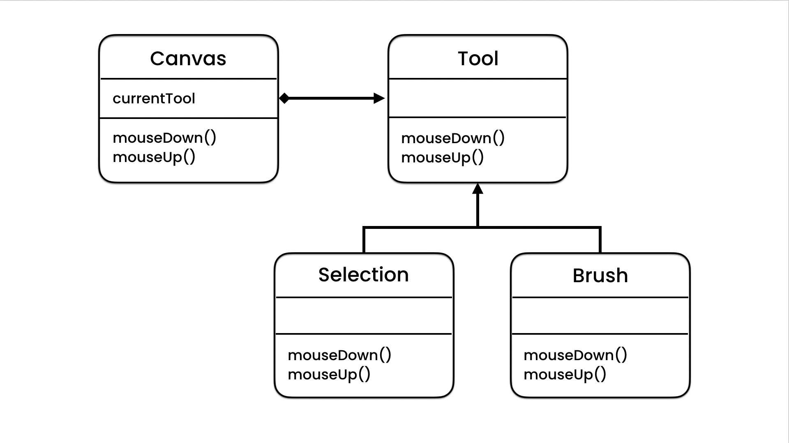

## When we use state pattern?

when we want to implement some features in our software like Brush or Selection in Photoshop, we use this pattern and this pattern make our project extendable.

UML of this pattern:


Tool interface:
```Java
public interface Tool {
    void mouseDown();
    void mouseUp();
}
```
BrushTool class:
```Java
public class BrushTool implements Tool {
    @Override
    public void mouseDown() {
        System.out.println("Brush icon");
    }

    @Override
    public void mouseUp() {
        System.out.println("Draw a line");
    }
}
```

SelectionTool class:

```Java
public class SelectionTool implements Tool {
    @Override
    public void mouseDown() {
        System.out.println("Selection icon");
    }

    @Override
    public void mouseUp() {
        System.out.println("Draw a dash rectangle");
    }
}
```

Canvas class
```Java
public class Canvas {
    private Tool currentTool;

    public void mouseDown(){
        currentTool.mouseDown();
    }

    public void mouseUp(){
        currentTool.mouseUp();
    }

    public Tool getCurrentTool() {
        return currentTool;
    }

    public void setCurrentTool(Tool currentTool) {
        this.currentTool = currentTool;
    }
}
```

Main class
```Java
var canvas = new Canvas();
canvas.setCurrentTool(new BrushTool());
canvas.mouseDown();
canvas.mouseUp();
```

## Open Closed Principle

This principle says we can extend our features and software and add new classes but we should not change our previous classes.

## Python State design pattern

Tool class:

```Python
class Tool:
    def mouse_down(self):
        pass

    def mouse_up(self):
        pass

```
BrushTool class:

```Python
from state.Tool import Tool


class BrushTool(Tool):
    def mouse_down(self):
        print("Brush icon")

    def mouse_up(self):
        print("Draw a line")

```

SelectionTool class:

```Python
from state.Tool import Tool


class SelectionTool(Tool):
    def mouse_down(self):
        print("Selection icon ")

    def mouse_up(self):
        print("Draw a dash rectangle")

```

Canvas class:

```Python
class Canvas:
    def __init__(self):
        self.__current_tool = None

    def mouse_down(self):
        self.__current_tool.mouse_down()

    def mouse_up(self):
        self.__current_tool.mouse_up()

    @property
    def current_tool(self):
        return self.__current_tool

    @current_tool.setter
    def current_tool(self, current_tool):
        self.__current_tool = current_tool

```

Main class:

```Python
from state.Brushtool import BrushTool
from state.Canvas import Canvas
from state.Selection_tool import SelectionTool

def main():
    canvas = Canvas()
    canvas.current_tool = SelectionTool()
    canvas.mouse_down()
    canvas.mouse_up()
    canvas.current_tool = BrushTool()
    canvas.mouse_up()
    canvas.mouse_down()
```