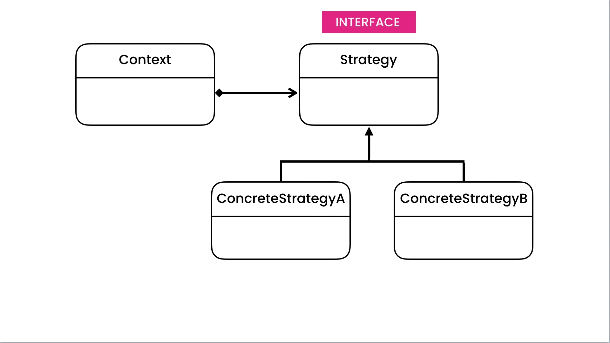

# What is Iterator pattern for?
This pattern changes the behave of the object and like a state pattern but it has little difference.



We want platform that store image but before store the image compress image and apply filter on that.
For this goal we use strategy pattern.

compressor_interface.py

```Python
import abc


class CompresorInterface(metaclass=abc.ABCMeta):
    @classmethod
    def __subclasshook__(cls, subclass):
        return (
            hasattr(subclass, 'compress') and
            callable(subclass.compress) or
            NotImplemented
        )

    @abc.abstractmethod
    def compress(self, fileName: str):
        raise NotImplementedError

```

filter_interface.py 

```Python
import abc


class FilterInterface(metaclass=abc.ABCMeta):
    @classmethod
    def __subclasshook__(cls, subclass):
        return (
            hasattr(subclass, 'apply') and
            callable(subclass.apply) or
            NotImplemented
        )

    @abc.abstractmethod
    def apply(self, fileName: str):
        raise NotImplementedError

```

Now implement the compressor and filter

black_filter.py

```Python
from filter_interface import FilterInterface


class BlackFilter(FilterInterface):
    def apply(self, fileName: str):
        print('Black filter apply on ' + fileName)

```
jpeg_compressor.py

```Python
from compresor_interface import CompresorInterface


class JpegCompress(CompresorInterface):
    def compress(self, fileName: str):
        print('JPEG Compress' + fileName)

```
In this section we implement storage class

image_storage.py

```Python
from compresor_interface import CompresorInterface
from filter_interface import FilterInterface


class ImageStorage:
    def store(
            self,
            fileName: str,
            compressor: CompresorInterface,
            filter: FilterInterface):
        compressor.compress(fileName)
        filter.apply(fileName)

```
main.py 

```Python
from image_storage import ImageStorage
from jpeg_compressor import JpegCompress
from black_filter import BlackFilter


def main():
    imageStorag = ImageStorage()
    imageStorag.store(
        'mamad',
        JpegCompress(),
        BlackFilter()
    )


if __name__ == '__main__':
    main()

```