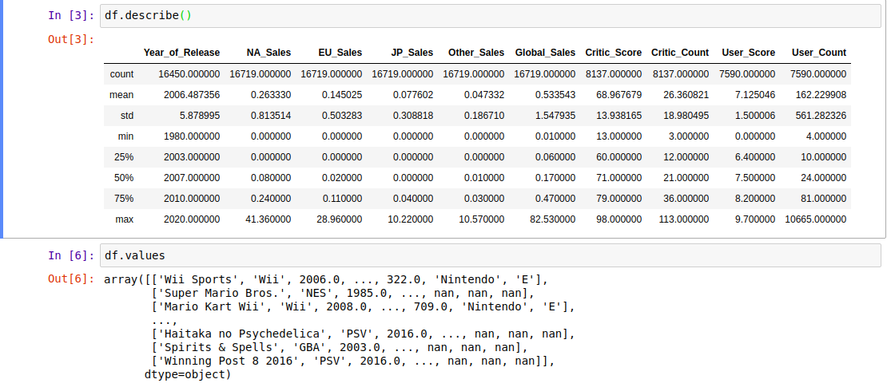

We can get datasets from kaggle and work with them. After download dataset you should load it in python program

```python
import pandas as pd
df = pd.read_csv('DATASET.csv')
df.shape()
```
```output
(16783,11) # 16783 rows and 11 columns
```
We can get a summary of data with describe() method and call values array that data from dataset load in it

```python
df.describe()
df.values
```
