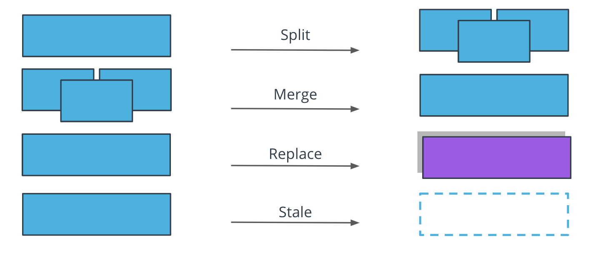

- Edge Case: Amorphous Applications
    In the previous sections, we have explored how to choose a suitable architecture for an application and how to apply some of the best development practices. However, this is only the start of the application lifecycle. After an engineering team has successfully released a product, with both monolith and microservices, the next phase in the application lifecycle is maintenance. In this edge case, we will explore commonly used maintenance operations after a product is released.

- Summary
    Throughout the maintenance stage, the application structure and functionalities can change, and this is expected! The architecture of an application is not static, it is amorphous and in constant movement. This represents the organic growth of a product that is responsive to customer feedback and new emerging technologies.

    Both monolith and microservice-based applications transition in the maintenance phase after the production release. When considering adding new functionalities or incorporating new tools, it is always beneficial to focus on extensibility rather than flexibility. Generally speaking, it is more efficient to manage multiple services with a well-defined and simple functionality (as in the case of microservices), rather than add more abstraction layers to support new services (as we’ve seen with the monoliths). However, to have a well-structured maintenance phase, it is essential to understand the reasons an architecture is chosen for an application and involved trade-offs.

    Some of the most encountered operations in the maintenance phase are listed below:
    

  - A split operation - is applied if a service covers too many functionalities and it's complex to manage. Having smaller, manageable units is preferred in this context.
  - A merge operation- is applied if units are too granular or perform closely interlinked operations, and it provides a development advantage to merge these together. For example, merging 2 separate services for log output and log format in a single service.
  - A replace operation - is adopted when a more efficient implementation is identified for a service. For example, rewriting a Java service in Go, to optimize the overall execution time.
  - A stale operation - is performed for      services that are no longer providing any business value, and should be archived or deprecated. For example, services that were used to perform a one-off migration process.

Performing any of these operations increases the longevity and continuity of a project. Overall, the end goal is to ensure the application is providing value to customers and is easy to manage by the engineering team. But more importantly, it can be observed that the structure of a project is not static. It amorphous and it evolves based on new requirements and customer feedback.