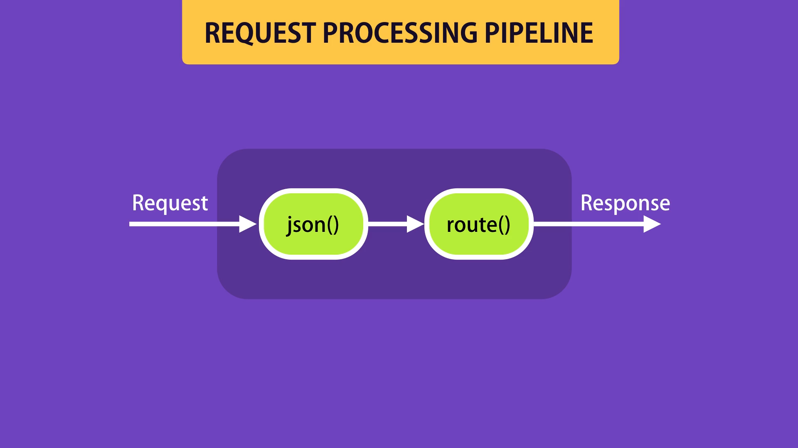

## What is advance topic?
- Middleware
- Configuration
- Debugging
- Templating Engines

## What is Middleware?
Middleware functions are functions that have access to the request object ( req ), the response object ( res ), and the next function in the application's request-response cycle.

For example see below code

```JS

app.use(express.json()) // Middleware
.
.
.
app.delete('/api/courses/:id', (req, res) => {
    // Middleware
    pass
})
```
The diagram of above code is


### Create Custom Middleware

```JS
app.use(function (req, res, next) {
    console.log("Loggg");
    next(); // it's important if you don't write the request processing pipline has got hange
})
```

### Built-in Middleware
```JS
app.use(express.urlencoded({ extended: true })) // it's not usefull now 
app.use(express.static('public')) // this middleware for serve static files and argument is folder name
```

### Third-party Middleware
We can read a complete list of third-party middleware in tis (link)[https://expressjs.com/en/resources/middleware.html]

there are two common middleware:
- helmet: Helmet helps you secure your Express apps by setting various HTTP headers.
- morgan: HTTP request logger middleware for node.js

#### Note 
Use middleware a lot is an effect on performance