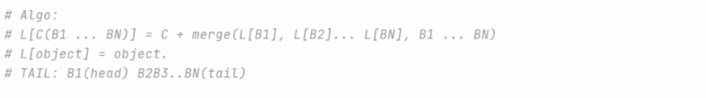

Instance attribute can defined in constructor or dynamic in the program.

```python
class test:
    def __init__(self):
        self.x = 10


t1 = test()
t1.y = 20
print(t1.x, t1.y)
```
```Output
10 20
```
Instance attribute or class attribute.
Note: For calling class attributes we should call throughout class name.

```python
class test:
    default_color = "red" # class attribute

    def __init__(self):
        self.x = 10 # Instance attribute
        test.default_color= 'yellow'
```

class methods are methods that related to the class

```python
class test:

    def __init__(self, x, y):
        self.x = x
        self.y = y

    @classmethod
    def zero(cls):
        return cls(0, 0)

    def draw(self):
        print(f"Point ({self.x},{self.y})")


point = test.zero()
point.draw()

```
There is a another type of method which is related to the class and it is static method 
```python
class test:

    def __init__(self, x, y):
        self.x = x
        self.y = y

    @staticmethod
    def isPositive(x):
        return x > 0
```
# Difference between Static Method and Class Method
- A class method takes cls as the first parameter while a static method needs no specific parameters.
- A class method can access or modify the class state while a static method can’t access or modify it.
- In general, static methods know nothing about the class state. They are utility-type methods that take some parameters and work upon those parameters. On the other hand class methods must have class as a parameter.
- We use @classmethod decorator in python to create a class method and we use @staticmethod decorator to create a static method in python.
- We generally use the class method to create factory methods. Factory methods return class objects ( similar to a constructor ) for different use cases.
- We generally use static methods to create utility functions.

## Note: It is important to call static method through a object with self not through a class name. When we use object for calling static our code become more flexible in inheritance.

Dunder or magic methods in Python are the methods having two prefix and suffix underscores in the method name and are called dunder Function Name. For more detail:
- https://rszalski.github.io/magicmethods/

```python
class test:

    def __init__(self, x, y):  # magic methods
        self.x = x
        self.y = y

    def __str__(self):  # magic methods
        return f"({self.x},{self.y})"

    def __eq__(self, other):  # magic methods
        return self.x == other.x and self.y == other.y

    def draw(self):
        print(f"Point ({self.x},{self.y})")

    def __add__(self, other):
        return test(self.x + other.x , self.y + other.y)

point_1 = test(10,20)
point_2 = test(1,2)
combine = point_1 + point_2

print(point_1)  # call __str__ method
print(point_1 == point_2)  # call __eq__ method
```
```Output
(10,20)
False
```
how to make custome containers in python 

```python
class TagCloud:

    def __init__(self):
        self.tags = {}

    def add(self, tag):
        self.tags[tag.lower()] = self.tags.get(tag.lower(), 0) + 1

    def __getitem__(self, tag):
        return self.tags.get(tag.lower(), 0)

    def __setitem__(self, tag, count):
        self.tags[tag.lower()] = count

    def __len__(self):
        return len(self.tags)

    def __iter__(self):
        return iter(self.tags)


cloud = TagCloud()
cloud.add("python")  # call add()
cloud.add("python")  # call add()
cloud.add("python")  # call add()
print(cloud["python"])  # call __getitem__()
cloud["python"] = 10  # call __setitem__()
print(cloud["python"])  # call __getitem__()
print(len(cloud))  # call __len__()
for item in cloud:  # call __iter__()
    print(item)

```
```Output
3
10
1
python
```

how to work with python class private member.
- Note: private member not for security, you can work with private member by complex way.

```python
class TagCloud:

    def __init__(self):
        self.__tags = {
            "python": 10
        }


cloud = TagCloud()
#print(cloud.__tags) return error

print(cloud._TagCloud__tags)

```
```Output
{'python' : 10}
```
how to implement setter and getter in python

first way

```python
class TagCloud:

    def __init__(self, tag):
        self.__tags = tag

    def get_tags(self):
        return self.__tags

    def set_tags(self, tag):
        if tag == "python":
            raise ValueError("Bad value " + tag)
        self.__tags = tag
    tags = property(get_tags, set_tags)

cloud = TagCloud("C++")
print(cloud.tags)
cloud.tags = "python1"
print(cloud.tags)

```
```Output
C++
python1
```
second way
- the second way is professional
```python
class TagCloud:

    def __init__(self, tag):
        self.__tags = tag
        # self.tags = tag --> self-encapsulation

    @property
    def tags(self):
        return self.__tags

    @tags.setter
    def tags(self, tag):
        if tag == "python":
            raise ValueError("Bad value " + tag)
        self.__tags = tag


cloud = TagCloud("C++")
cloud.tags = "python1"
print(cloud.tags)

```
```Output
C++
python1
```
## Note: We can use encapsulation in python (@property) to calculate some value on the fly, for example we store temperature celsius but in some situation need temperature in fahrenheit so we calculate from celsius and return.

# Inheritance in python
- Note: don't use more than 2 levels inheritance because decrease your code compatibility.  
Call parent class in constructor

```python
class Animal:
    def __init__(self):
        pass


class Fish(Animal):
    def __init__(self):
        super().__init__()
        pass
```
Don't use multiple inheritances in a bad way. a good way to use multiple inheritance is the way that parent classes don't have overlap.  

```python
#Bad code
class Animal:
    def eat(self):
        print("Animal Eat")


class Fish:
    def eat(self):
        print("Fish Eat")


class Wall(Fish,Animal):
    pass

class Dolphin(Animal,Fish):
    pass
W = Wall()
D = Dolphin()
W.eat()
D.eat()
```
```Output
Fish Eat
Animal Eat
```
## What is Method Resolution Order (MRO)?
MRO is a concept used in inheritance. It is the order in which a method is searched for in a classes hierarchy and is especially useful in Python because Python supports multiple inheritance.

```python
class A:
    pass

class B:
    pass

class C(B,A):
    pass

print(C.__mro__)
```
```Output
(<class '__main__.C'>, <class '__main__.B'>, <class '__main__.A'>, <class 'object'>)
```
### How is MRO used?
- python finds the MRO for type of the object on which a method is invoked
- python checks each class in MRO in order to find one that implements the method
- the first implementation found is used

### How is MRO calculated ?
Python uses C3 algorithm for calculating the order of classes and this causes some limitations for implementing multiple inheritance.
This is C3 algorithm:


In this link C3 is explained [link](https://www.youtube.com/watch?v=IqwWxZrMcx4)

```python
class A:
    pass


class B(A):
    pass


class C(A, B):
    pass


print(C.__mro__)
```
```Output
Traceback (most recent call last):
  File "/Users/blue-day/Desktop/test_/main.py", line 34, in <module>
    class C(A, B):
TypeError: Cannot create a consistent method resolution
order (MRO) for bases A, B
```

The above example has problem and we can fix it with C3 algorithm.
## Note: In inheritance we should use delegate function for Properties and then in overriding we should override that function.

```python
class TagCloud:

    def __init__(self, tag):
        self.__tags = tag
        # self.tags = tag --> self-encapsulation

    @property
    def tags(self):
        self._tags_name()
    
    def _tags_get(self):
        return self.__tags

    @tags.setter
    def tags(self, tag):
        self._tags_set(tag)
    
    def _tags_set(self, tag):
        if tag == "python":
            raise ValueError("Bad value " + tag)
        self.__tags = tag

class emoji(TagCloud):
    def __init__(self):
        pass
    
    def _tags_get(self):
        return super()._tags_get() + ' emoji'
    
    def _tags_set(self, tag):
        if tag == "emoji":
            raise ValueError("Bad value " + tag)
        super()._tags_set(tag)
```

# Dunder repr function(__repr__) 
Is a special method used to represent a class's objects as a string. __repr__ is called by the repr() built-in function.
This function shows string value for each object and it uses for developer.

```python
class Tag:
    def __init__(self, tag: str):
        self.tag = tag
    
    def __repr__(self):
        return f"tag : {self.tag}"

t1 = Tag(tag= "python")
print(t1)
repr(t1)
```
```Output
tag : python
'tag: python'
```

# Dunder str function(__str__)
This function is like __repr__, but it is used for external customers and represent data for them.

# Dunder format function(__format__)
This function is like dunder str, but it is used for represent in format string, and most of the time it is useful when we want to represent float number in string and we want to customise decimal places.