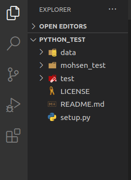
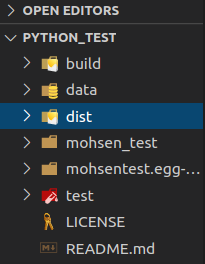

## You want to publish your own packages? this note about it. There are several steps to publish the package.

### Step 1
Install setuptools, twine, wheel as global with below command

```terminal
pip install setuptools twine wheel
```
### Step 2
Beside package directory create test and data directories and README.md and LICENSE and setup.py files

- You can see all license in: https://choosealicense.com



### Step 3
In setup.py you should write this code

```python
import setuptools
from pathlib import Path

setuptools.setup(
    name="mohsentest", # package name in pypi.org and should be unique
    version=1.0, 
    long_description=Path("README.md").read_text(), # insert readme file to the project
    packages=setuptools.find_packages(exclude=["test", "data"]) # don't include test and data directory to the package
)

```

### Step 4
Build source and build distributions with the below command

```terminal
python setud.py sdist bdist_wheel
```



### Finall step
Upload the dist directory files and folders to the pypi.org with below command

```terminal
twine upload dist/*
```
